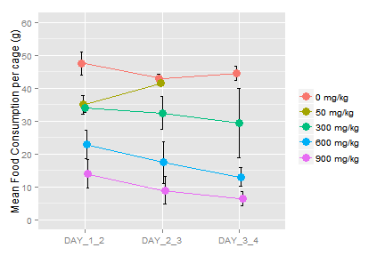

MINITOX - QUICK SUMMARY
=======================

STUDY INFORMATION
-----------------


```
Project                         | HBsAg (2)                                   
Theme No.                       | 70010                                       
Compound SRN                    | RO7011975-000                               
Compound ERN                    | RO7011975-000-007                           
GLP Status                      | Non-GLP                                     
Safety Plan ID                  | N/A                                         
Groups                          | 5                                           
Doses                           | 0, 100, 300, 600 and 900 mpk                
Route of Administration         | Oral Gavage                                 
Frequency of administration     | qd                                          
Animal Species and Strain       | Wistar-Han Rat                              
First Dosing Date               | Jan 16, 2014                                
Last Dosing Date                | Jan 19, 2014                                
Necropsy Date                   | Jan 20, 2014                                
Day                             | 4                                           
Study Director                  | Spacey Sun                                  
TPL                             | Dr. Jack Xie                                
DPL                             | Dr. Frances Wang                            
In-life Procedures              | Xiaoqin Wu, Sunfeng Huang                   
Formulation Analysis            | Dr. Wei Li, Wei Zhang                       
Bioanalysis                     | Sheng Zhong, Jian Xin, Yan Bo, Dr. Wenzhe Lu
Clinical Pathology              | Shuang Qiao (Medicilon)                     
Histopathology                  | Dr. Xiuying Yang (WuxiApptec)               
Histopathology Peer Review      | Dr. Bjoern Jacobsen                         
 -- Group Information --        |  -- Group Information --                    
Group 1: 101-103                | enter information here                      
Group 2: 201-203                | enter information here                      
Group 3: 301-303                | enter information here                      
```

******
1. BODY WEIGHT
--------------

### 1.1 Body Weight - Summary Table

```
      DOSE   DAY_1   DAY_2    DAY_3    DAY_4
   0 mg/kg 255 ± 8 260 ± 9 264 ± 11 270 ± 10
  50 mg/kg 256 ± 5 256 ± 6  259 ± 7  200 ± 1
 300 mg/kg 256 ± 7 254 ± 5  254 ± 6  254 ± 8
 600 mg/kg 256 ± 3 250 ± 3  243 ± 3  234 ± 3
 900 mg/kg 255 ± 3 245 ± 6  234 ± 5  224 ± 5
```

### 1.2 Body Weight - Statistical Analysis

```
                DOSE  DAY_1  DAY_2   DAY_3   DAY_4
             0 mg/kg    ---    ---     ---     ---
            50 mg/kg    ---    ---     --- p<0.001
           300 mg/kg    ---    ---     ---  p<0.05
           600 mg/kg    ---    ---  p<0.01 p<0.001
           900 mg/kg    --- p<0.05 p<0.001 p<0.001
              LEVENE   FAIL   PASS    PASS    PASS
          ANOVA (p=)      - 0.0305   1e-04       0
 KRUSKAL-WALLIS (p=) 0.9859      -       -       -
         - SUMMARY -    ---      *     ***     ***
```


### 1.3 Body Weight - Charts
 

 

******
2 BODY WEIGHT GAIN
------------------

### 2.1 Body Weight Gain - Summary Table

```
      DOSE   DAY_2   DAY_3   DAY_4     SUM
   0 mg/kg   6 ± 2   4 ± 2   6 ± 2  15 ± 3
  50 mg/kg   0 ± 1   3 ± 2 -59 ± 8 -56 ± 5
 300 mg/kg  -2 ± 5   0 ± 2   0 ± 5  -1 ± 9
 600 mg/kg  -6 ± 1  -7 ± 3  -9 ± 2 -21 ± 2
 900 mg/kg -10 ± 4 -12 ± 3 -10 ± 2 -31 ± 5
```

### 2.2 Body Weight Gain - Statistical Aanalysis

```
                DOSE   DAY_2   DAY_3  DAY_4     SUM
             0 mg/kg     ---     ---    ---     ---
            50 mg/kg     ---     --- p<0.05 p<0.001
           300 mg/kg  p<0.05     ---    ---  p<0.01
           600 mg/kg p<0.001 p<0.001    --- p<0.001
           900 mg/kg p<0.001 p<0.001    --- p<0.001
              LEVENE    PASS    PASS   FAIL    PASS
          ANOVA (p=)       0       0      -       0
 KRUSKAL-WALLIS (p=)       -       - 0.0017       -
         - SUMMARY -     ***     ***     **     ***
```

### 2.3 Body Weight Gain - Charts
 

 

 

******
3. FOOD CONSUMPTION
-------------------

### 3.1 Food Consumption - Summary Table

```
      DOSE     SUM DAY_1_2 DAY_2_3 DAY_3_4
   0 mg/kg 135 ± 4  48 ± 4  43 ± 1  44 ± 2
  50 mg/kg 254 ± 1  35 ± 3  42 ± 1 178 ± 5
 300 mg/kg 96 ± 17  34 ± 1  32 ± 5 30 ± 11
 600 mg/kg 54 ± 13  23 ± 4  18 ± 6  13 ± 3
 900 mg/kg 30 ± 11  14 ± 4   9 ± 4   6 ± 2
```

### 3.2 Food Consumption - Charts
 

 

 

******
4. CLINICAL PATHOLOGY
---------------------

### 4.1 Clinical Pathology - Summary Table

```
 DOSE      ALP            TBIL    UREA        ASP           
 0 mg/kg   203.75 ± 50.72 0.1 ± 0 7.41 ± 0.79 111.25 ± 14.61
 50 mg/kg  816.25 ± 12.5  0.1 ± 0 7.14 ± 1.01 109.75 ± 12.55
 300 mg/kg 229 ± 23.68    0.1 ± 0 6.6 ± 1.44  104 ± 9.59    
 600 mg/kg 224.25 ± 56.96 0.1 ± 0 8.03 ± 1.69 120.25 ± 13.3 

---

 DOSE      ALT         GGT   UN           CREA       
 0 mg/kg   32 ± 6.27   0 ± 0 20.75 ± 2.22 0.25 ± 0.06
 50 mg/kg  40 ± 4.08   0 ± 0 20 ± 2.83    0.25 ± 0.06
 300 mg/kg 47.5 ± 8.58 0 ± 0 18.5 ± 4.04  0.25 ± 0.06
 600 mg/kg 67 ± 10.92  0 ± 0 22.5 ± 4.73  0.22 ± 0.05

---

 DOSE      TP          ALB         GLO         AG         
 0 mg/kg   6.47 ± 0.24 4.62 ± 0.17 1.85 ± 0.26 2.52 ± 0.39
 50 mg/kg  6.12 ± 0.46 4.42 ± 0.38 1.7 ± 0.14  2.6 ± 0.22 
 300 mg/kg 6.17 ± 0.29 4.22 ± 0.25 1.95 ± 0.06 2.2 ± 0.12 
 600 mg/kg 6.05 ± 0.06 4.17 ± 0.28 1.88 ± 0.22 2.27 ± 0.41

---

 DOSE      GLU          TCHO          TG           NA.          
 0 mg/kg   74.75 ± 11.5 73.75 ± 13.05 83 ± 21.74   143.5 ± 0.58 
 50 mg/kg  79.5 ± 7     75.25 ± 12.42 92 ± 26.28   143.25 ± 0.96
 300 mg/kg 69.5 ± 11.39 61.25 ± 13.87 60.5 ± 21.44 142.75 ± 0.96
 600 mg/kg 61 ± 11.52   72.25 ± 15.8  92.5 ± 16.62 142 ± 1.15   

---

 DOSE      K           CL          CA           P          
 0 mg/kg   5.42 ± 0.34 97 ± 0.82   11.43 ± 0.3  9.72 ± 1.02
 50 mg/kg  5.4 ± 0.18  98.5 ± 0.58 11.32 ± 0.42 8.95 ± 1.06
 300 mg/kg 5.45 ± 0.13 98 ± 1.63   11.45 ± 0.33 8.82 ± 1.38
 600 mg/kg 5.72 ± 0.45 97 ± 2.16   11.4 ± 0.36  9.38 ± 0.43

---

 DOSE      CK               WBC         RBC         HGB         
 0 mg/kg   1296 ± 306.78    5.95 ± 1.62 8.41 ± 0.35 16.12 ± 0.83
 50 mg/kg  1115 ± 115.22    7.17 ± 1.26 7.59 ± 0.26 14.8 ± 0.59 
 300 mg/kg 1152.25 ± 273.96 7.77 ± 1.14 8.12 ± 0.55 15.02 ± 0.39
 600 mg/kg 1294.75 ± 286.51 9.69 ± 1.22 8.13 ± 0.22 15.68 ± 0.56

---

 DOSE      HCT          MCV          MCH          MCHC        
 0 mg/kg   51.25 ± 2.1  60.92 ± 2.2  19.15 ± 0.73 31.48 ± 0.47
 50 mg/kg  47.17 ± 2.2  62.15 ± 1.64 19.48 ± 0.39 31.35 ± 0.5 
 300 mg/kg 48.8 ± 2.31  60.12 ± 1.45 18.52 ± 0.76 30.85 ± 0.74
 600 mg/kg 48.77 ± 0.68 59.95 ± 1.03 19.25 ± 0.39 32.15 ± 0.7 

---

 DOSE      PLT             RDW.CV       NEUT        NEUT_PER    
 0 mg/kg   884.25 ± 171.3  11.5 ± 0.36  0.88 ± 0.39 15.38 ± 7.12
 50 mg/kg  892.5 ± 218.03  12.18 ± 0.78 1.14 ± 0.36 15.7 ± 3.22 
 300 mg/kg 877.25 ± 212.6  12.15 ± 0.48 1.25 ± 0.73 15.98 ± 7.86
 600 mg/kg 1074.5 ± 142.16 12.68 ± 0.19 1.83 ± 0.75 18.62 ± 6.01

---

 DOSE      LYMPH       LYMPH_PER    MONO        MONO_PER   
 0 mg/kg   4.84 ± 1.64 80.85 ± 8.27 0.11 ± 0.05 1.82 ± 0.51
 50 mg/kg  5.77 ± 0.98 80.65 ± 4    0.11 ± 0.05 1.5 ± 0.45 
 300 mg/kg 6.12 ± 1.06 78.88 ± 9.32 0.17 ± 0.07 2.23 ± 0.67
 600 mg/kg 7.35 ± 0.86 76.07 ± 6.16 0.26 ± 0.06 2.77 ± 0.87

---

 DOSE      EO          EO_PER      BASO        BASO_PER   
 0 mg/kg   0.08 ± 0.05 1.42 ± 1.05 0.01 ± 0.01 0.2 ± 0.08 
 50 mg/kg  0.07 ± 0.05 1.05 ± 0.87 0.02 ± 0.01 0.32 ± 0.13
 300 mg/kg 0.1 ± 0.06  1.32 ± 0.88 0.03 ± 0.01 0.32 ± 0.1 
 600 mg/kg 0.08 ± 0.04 0.8 ± 0.32  0.04 ± 0.01 0.38 ± 0.17

---

 DOSE      LUC         LUC_PER     RET            RET_PER    
 0 mg/kg   0.02 ± 0.01 0.35 ± 0.1  357.73 ± 25.44 4.25 ± 0.33
 50 mg/kg  0.06 ± 0.03 0.75 ± 0.26 330.07 ± 80.44 8.01 ± 0.1 
 300 mg/kg 0.1 ± 0.05  1.2 ± 0.45  275.15 ± 87.67 3.36 ± 0.95
 600 mg/kg 0.12 ± 0.03 1.3 ± 0.48  245.9 ± 101.97 3.05 ± 1.33

---
```


### 4.2 Clinical Pathology - Statistical Analysis

```
                DOSE     ALP     ALT    WBC    RBC    HGB
             0 mg/kg     ---     ---    ---    ---    ---
            50 mg/kg p<0.001     ---    --- p<0.05 p<0.05
           300 mg/kg     ---     ---    ---    ---    ---
           600 mg/kg     --- p<0.001 p<0.01    ---    ---
              LEVENE    PASS    PASS   PASS   PASS   PASS
          ANOVA (p=)       0   3e-04 0.0125 0.0499 0.0367
 KRUSKAL-WALLIS (p=)       -       -      -      -      -
         - SUMMARY -     ***     ***      *      *      *

---

                DOSE    HCT RDW.CV  LYMPH   MONO   BASO
             0 mg/kg    ---    ---    ---    ---    ---
            50 mg/kg p<0.05    ---    ---    ---    ---
           300 mg/kg    ---    ---    ---    ---    ---
           600 mg/kg    --- p<0.05 p<0.05 p<0.05 p<0.05
              LEVENE   PASS   PASS   PASS   PASS   PASS
          ANOVA (p=) 0.0723 0.0426 0.0658 0.0084 0.0667
 KRUSKAL-WALLIS (p=)      -      -      -      -      -
         - SUMMARY -    ---      *    ---     **    ---

---

                DOSE    LUC LUC_PER
             0 mg/kg    ---     ---
            50 mg/kg    ---     ---
           300 mg/kg p<0.05  p<0.05
           600 mg/kg p<0.01  p<0.05
              LEVENE   PASS    PASS
          ANOVA (p=) 0.0034  0.0099
 KRUSKAL-WALLIS (p=)      -       -
         - SUMMARY -     **      **
```

#### Full Names of Indices with Statistical Significance

```
ALP  -  Alkaline Phosphatase (U/L)                      
ALT  -  Alanine Aminotransferase (U/L)                  
WBC  -  White Blood Cells  (10^9/L)                     
RBC  -  Red Blood Cells (10^12/L)                       
HGB  -  Hemoglobin (g/L)                                
HCT  -  Hematocrit (%)                                  
RDW.CV  -  Red Blood Cell Distribution of Width - CV (%)
LYMPH  -  Lymphocytes (10^9/L)                          
MONO  -  Monocytes (10^9/L)                             
BASO  -  Basophils (10^9/L)                             
LUC  -  Large Unstained Cells (10^9/L)                  
LUC_PER  -  Large Unstained Cells (%)                   
```

### 4.3 Clinical Pathology - Charts
 

******
5. ADDITIONAL INFORMATION
-------------------------

### 5.1 Clinical Observations

```
Animal 507 (TK animal)  : Died on Day 5 before necropsy
```

### 5.2 Gross Findings at Necropsy

# If there are no findings at necropsy, use the following lines.

```
Animal NA (NA - NA
```

# If there are findings at necropsy, use the following lines.

```
Error in 1:(nrow(necro_obs) - 1): 参数长度为零
```


```
THE SUMMARY WAS CREATED ON 2015-03-16 18:53:02.
```
